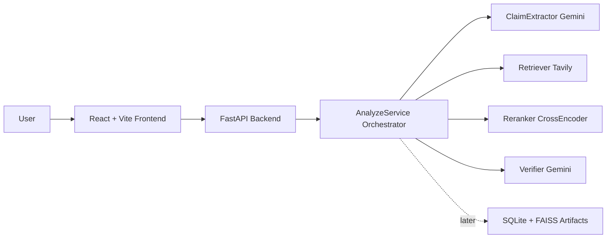

# Architecture

VeritasAI is organized as a modular full-stack system.

Milestone 4 implements the complete core backend pipeline. Persistence, authentication, deployment hardening, and frontend result rendering are separate future milestones.
